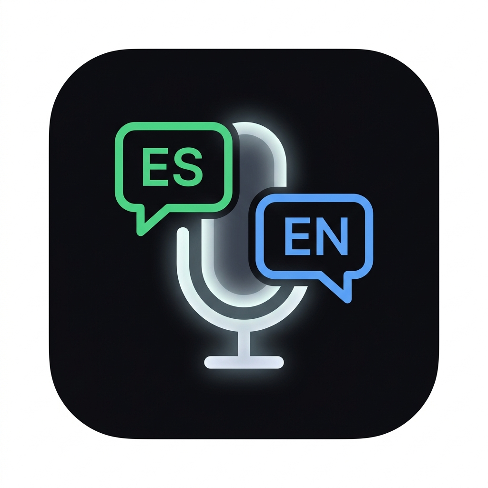
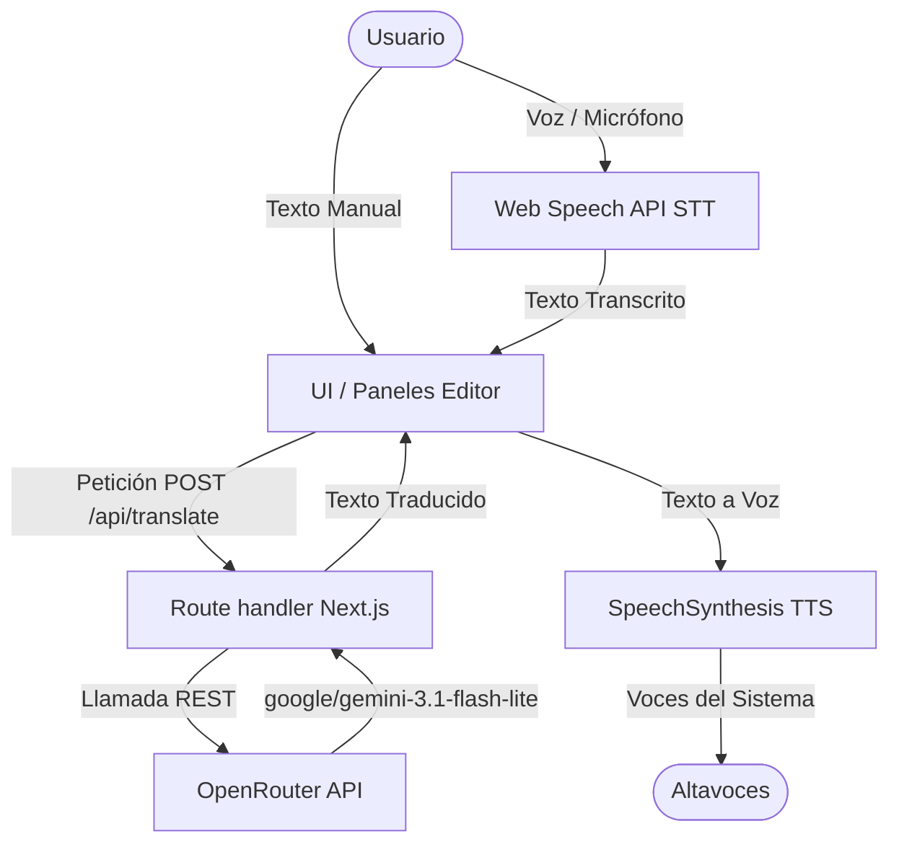

# IntérpreteAI ── Traductor Simultáneo Premium

<div align="center">



[](https://github.com/cristborrero/interprete-ai/stargazers)
[](LICENSE)
[](https://nextjs.org/)
[](https://www.typescriptlang.org/)
[](https://tailwindcss.com/)

</div>

<br>

## 📖 Acerca de

**IntérpreteAI** es un sistema de interpretación simultánea bidireccional Español ↔ Inglés en tiempo real, diseñado con un estándar visual premium. Está optimizado para entornos profesionales y de salud en el Reino Unido, facilitando la comunicación fluida entre personas hispanohablantes (por ejemplo, de Colombia) y profesionales de habla inglesa.

La interfaz ofrece un diseño oscuro elegante de alto contraste, animaciones sutiles, selectores de voz dinámicos y un flujo interactivo de traducción mediante reconocimiento y síntesis de voz directo en el navegador.

---

## 🚀 Características Principales

*   **Traducción Inteligente**:
    *   Integración con **OpenRouter API** usando el modelo `google/gemini-3.1-flash-lite` para traducciones contextuales rápidas y precisas.
*   **Speech-to-Text (STT) y Text-to-Speech (TTS) nativo**:
    *   **Reconocimiento de voz**: Utiliza la Web Speech API nativa del navegador para transcribir la voz en tiempo real con detección inteligente del flujo.
    *   **Síntesis de voz**: Emplea el motor de `window.speechSynthesis` del sistema operativo. Permite seleccionar y configurar la velocidad de reproducción de las voces del sistema instaladas localmente.
*   **Interfaz de Élite**:
    *   Diseño oscuro con estética Glassmorphism, efectos de luces sutiles en los bordes y micro-animaciones (corona de respiración verde en el botón central de activación de voz).
    *   Modo de interacción Push-to-Talk (PTT) o escucha continua.
    *   Paneles paralelos independientes para edición manual de la transcripción y el resultado de la traducción.

---

## 🛠️ Arquitectura del Sistema



---

## 📦 Estructura del Proyecto

El proyecto sigue una estructura limpia basada en Next.js (App Router):

```text
├── src/
│   ├── app/                 # Rutas y configuración de Next.js
│   │   ├── api/
│   │   │   └── translate/   # Endpoint que conecta con OpenRouter
│   │   │       └── route.ts
│   │   ├── globals.css      # Sistema de diseño, variables de color y animaciones premium
│   │   ├── layout.tsx
│   │   └── page.tsx
│   ├── components/          # Componentes visuales
│   │   └── InterpreterApp.tsx  # Interfaz unificada de la aplicación
│   ├── hooks/               # Lógica de traducción y speech
│   │   └── useInterpreter.ts  # Hook unificado de Web Speech STT, TTS y traducción REST
│   ├── types/               # Definiciones de TypeScript
│   │   └── speech.d.ts      # Tipos manuales para Web Speech API
│   └── lib/                 # Utilidades generales
├── public/                  # Assets públicos
└── tailwind.config.ts       # Configuración del motor de estilos y gradientes
```

---

## 🔧 Guía de Instalación y Uso

### 1. Clonar el repositorio
```bash
git clone https://github.com/cristborrero/interprete-ai.git
cd interprete-ai
```

### 2. Instalar dependencias
```bash
npm install
```

### 3. Configurar variables de entorno
Crea un archivo `.env.local` en la raíz del proyecto y añade tu API key de OpenRouter:
```env
OPENROUTER_API_KEY=tu_api_key_de_openrouter_aqui
```

### 4. Ejecutar el servidor de desarrollo
```bash
npm run dev
```
Abre [http://localhost:3000](http://localhost:3000) en tu navegador.

---

## 🎙️ Configuración y Calidad de las Voces (TTS)

Dado que la síntesis de voz utiliza el motor nativo del navegador, la calidad depende directamente de las voces instaladas en tu sistema operativo:

*   **En macOS / iOS**: 
    1. Ve a **Ajustes del Sistema** ➔ **Accesibilidad** ➔ **Contenido leído** ➔ **Voz del sistema**.
    2. Entra a **Gestionar voces...** e instala voces de alta calidad (HQ) como **Mónica** para Español o **Daniel** y **Samantha** para Inglés.
*   **En Windows / Android / Chrome**: 
    *   Chrome y Edge instalan por defecto voces sintéticas en la nube que ofrecen una entonación natural de manera automática.

---

## 📄 Licencia

Este proyecto está bajo la Licencia MIT.
