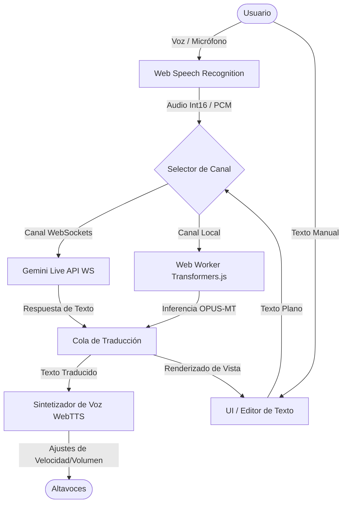

# IntérpreteAI ── Traductor Simultáneo Premium

<div align="center">

[](https://github.com/cristborrero/interprete-ai/stargazers)
[](LICENSE)
[](https://nextjs.org/)
[](https://www.typescriptlang.org/)
[](https://tailwindcss.com/)

</div>

IntérpreteAI es un sistema de interpretación simultánea bidireccional Español ↔ English en tiempo real, diseñado con un estándar visual premium y optimizado para entornos profesionales y de salud. Combina la potencia del procesamiento en la nube con la flexibilidad del procesamiento local (offline).

---

## 🚀 Características Principales

*   **Dual Engine (Híbrido)**:
    *   **En Línea (Gemini Live API)**: Utiliza `gemini-2.5-flash-live` a través de un canal WebSockets bidireccional continuo para lograr traducciones de baja latencia y alta comprensión contextual.
    *   **Local (OPUS-MT Offline)**: Emplea modelos compactos de traducción de Helsinki-NLP (`Xenova/opus-mt-es-en` y `Xenova/opus-mt-en-es`) que corren localmente en el navegador a través de un Web Worker con **Transformers.js**. Los modelos se descargan la primera vez (~150MB) y quedan cacheados de forma persistente en **IndexedDB**.
*   **Speech-to-Text & Text-to-Speech Fluido**:
    *   Captura de voz a través del micrófono usando Web Speech API nativa.
    *   Sintetizador de voz integrado (TTS) con controles dinámicos de volumen y velocidad de habla directamente desde la interfaz.
*   **Interfaz de Elite**:
    *   Diseño oscuro con estética Glassmorphism, relieve de luz y micro-animaciones fluidas (corona de luz verde esmeralda y respiración en el disparador de voz central).
    *   Editores de traducción interactivos con capacidad de edición manual e input por teclado.
    *   Gestión de frases favoritas sincronizadas en `localStorage` y panel de historial de diálogos.

---

## 🛠️ Arquitectura del Sistema

El siguiente diagrama detalla cómo interactúan los diferentes componentes de audio, traducción y síntesis de voz del sistema:



---

## 📦 Estructura del Proyecto

El proyecto sigue una estructura limpia basada en Next.js (App Router):

```text
├── src/
│   ├── app/                 # Rutas y punto de entrada de la aplicación
│   │   ├── api/             # Endpoints del servidor (ej. obtención de tokens temporales de Gemini)
│   │   └── globals.css      # Sistema de diseño, variables de color y animaciones premium
│   ├── components/          # Componentes visuales (InterpreterApp, TranscriptPanel, Waveform)
│   ├── hooks/               # Hooks custom de conexión (useGeminiLive, useOfflineInterpreter)
│   ├── workers/             # Web Worker para inferencia offline aislada del hilo principal de UI
│   └── lib/                 # Utilidades generales y helpers de diseño
├── public/                  # Assets públicos y manifiesto PWA
└── tailwind.config.ts       # Configuración del motor de estilos y gradientes
```

---

## 🔧 Guía de Instalación y Uso

### 1. Clonar el repositorio
```bash
git clone https://github.com/cristborrero/interprete-ai.git
cd interprete-ai
```

### 2. Instalar dependencias
```bash
npm install
```

### 3. Configurar variables de entorno
Crea un archivo `.env.local` en la raíz del proyecto y añade tu API key de Google Gemini:
```env
GEMINI_API_KEY=tu_api_key_aqui
```

### 4. Correr servidor de desarrollo
```bash
npm run dev
```
Abre [http://localhost:3000](http://localhost:3000) en tu navegador para ver y probar la aplicación.

---

## 🛡️ Estándares de Diseño y Desarrollo

*   **Sin emojis**: Se utiliza iconografía SVG vectorizada y escalable para mantener una estética profesional y limpia.
*   **Performance Isolation**: Las traducciones locales corren enteramente en un Web Worker en segundo plano, garantizando que la interfaz principal mantenga 60fps constantes incluso durante la descarga e inferencia del modelo.
*   **Local-First & Privacy**: Las conversaciones procesadas en el modo local nunca abandonan el dispositivo del usuario.

---

## 📄 Licencia

Este proyecto está bajo la Licencia MIT.
